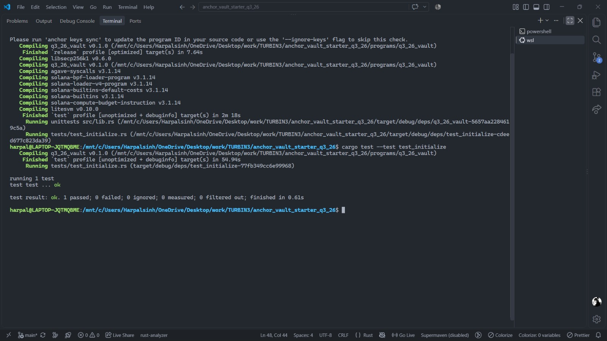

# Solana Anchor Vault

A clean Rust-based Solana Vault program built with the Anchor Framework. The program allows users to initialize a personal PDA-based vault, deposit SOL, withdraw SOL, and close the vault while reclaiming its remaining lamports.

The project includes an automated integration test using LiteSVM that validates the complete vault lifecycle.

---

## Project Structure

```text
├── programs/
│   └── q3_26_vault/
│       ├── src/
│       │   ├── instructions/
│       │   │   ├── initialize.rs     # Creates vault state and vault PDA
│       │   │   ├── deposit.rs        # Deposits SOL into the vault
│       │   │   ├── withdraw.rs       # Withdraws SOL from the vault
│       │   │   └── close.rs          # Closes the vault and returns lamports
│       │   ├── constants.rs          # PDA seed constants
│       │   ├── error.rs              # Custom program errors
│       │   ├── state.rs              # VaultState account definition
│       │   └── lib.rs                # Program entrypoints
│       └── Cargo.toml
│
├── programs/q3_26_vault/tests/
│   └── test_initialize.rs            # Full vault lifecycle integration test
│
├── Anchor.toml
├── Cargo.toml
└── README.md
```

---

## Features

- Initialize a personal SOL vault using Program Derived Addresses (PDAs)
- Store vault and state PDA bumps on-chain
- Deposit SOL into the vault
- Withdraw SOL using PDA signer seeds
- Close the vault and reclaim remaining lamports
- Validate withdrawal amounts
- Integration testing with LiteSVM
- Fully tested vault lifecycle

---

## Vault Architecture

Each user receives two PDAs.

### Vault State PDA

Seeds: `[STATE, user_pubkey]`

The `VaultState` account stores:

| Field        | Description                         |
| :----------- | :---------------------------------- |
| `state_bump` | PDA bump for the VaultState account |
| `vault_bump` | PDA bump for the Vault account      |

### Vault PDA

Seeds: `[VAULT_SEED, user_pubkey]`

The vault PDA is a System Account that holds the user's SOL.

### Relationship Diagram

```text
                    User
                     │
             ┌───────┴────────┐
             │                │
             ▼                ▼
       VaultState PDA      Vault PDA
       [STATE, user]   [VAULT_SEED, user]
             │                │
             │                │
             │             SOL balance
             │
        Stores bumps
```

---

## Vault Lifecycle

The integration test validates the following sequence:

```text
Initialize
    │
    ▼
Create VaultState + Vault PDA
    │
    ▼
Deposit 0.5 SOL
    │
    ▼
Withdraw 0.1 SOL
    │
    ▼
Close Vault
    │
    ▼
Vault balance → 0
VaultState → closed
```

---

## Instructions

### 1. Initialize

Creates the user's VaultState PDA and initializes the vault PDA. The vault is funded with the minimum rent-exempt balance.

```text
STATE + user_pubkey
        │
        ▼
   VaultState PDA

VAULT_SEED + user_pubkey
        │
        ▼
      Vault PDA
```

The vault and state PDA bumps are stored in `VaultState`.

### 2. Deposit

Transfers SOL from the user into their vault.

```text
User ───────────────► Vault PDA
       SOL deposit
```

The user is the transaction signer, so a normal CPI context is sufficient:

```rust
CpiContext::new(...)
```

### 3. Withdraw

Transfers SOL from the vault PDA back to the user.

```text
Vault PDA ──────────► User
           SOL
```

Because the vault is a PDA, the program must sign the System Program CPI using the vault's PDA seeds:

```rust
CpiContext::new_with_signer(...)
```

The signer seeds are:

```rust
[
    VAULT_SEED,
    user_pubkey,
    vault_bump,
]
```

### 4. Close

Transfers the remaining SOL from the vault PDA back to the user and closes the VaultState account. The vault PDA again signs the System Program transfer using its PDA seeds.

The state account uses Anchor's `close = user` constraint so that the state account is closed and its lamports are returned to the user.

---

## Testing

The integration test uses LiteSVM to execute the complete vault lifecycle without requiring a live Solana cluster.

### Test Flow

| Step | Operation  | Expected Result                     |
| :--- | :--------- | :---------------------------------- |
| 1    | Initialize | VaultState and Vault PDA created    |
| 2    | Check rent | Vault contains rent-exempt balance  |
| 3    | Deposit    | Vault increases by 0.5 SOL          |
| 4    | Withdraw   | Vault decreases by 0.1 SOL          |
| 5    | Close      | Vault emptied and VaultState closed |

The test specifically verifies:

```text
Initial vault balance
        +
500,000,000 lamports deposit
        -
100,000,000 lamports withdrawal
        =
Expected final vault balance
```

### Run Tests

Build the Anchor program:

```bash
anchor build
```

Run the integration test:

```bash
cargo test --test test_initialize
```

A successful execution should look similar to:

```text
running 1 test
test test ... ok

test result: ok. 1 passed; 0 failed
```

---

## PDA Signer Model

The most important part of the vault's security model is PDA signing.

The vault is derived using:

```rust
Pubkey::find_program_address(
    &[VAULT_SEED, user.pubkey().as_ref()],
    &program_id,
)
```

When SOL needs to leave the vault, the program signs on behalf of the PDA using:

```rust
let signer_seeds = &[&[
    VAULT_SEED,
    user_key.as_ref(),
    &[vault_bump],
]];
```

This allows the System Program CPI to authorize `Vault PDA → User` without requiring a private key for the PDA.

---

## Tech Stack

| Component      | Technology                       |
| :------------- | :------------------------------- |
| Blockchain     | Solana                           |
| Framework      | Anchor                           |
| Language       | Rust                             |
| Testing        | LiteSVM                          |
| Program        | `q3_26_vault`                    |
| System Program | Solana System Program            |
| Account Model  | Program Derived Addresses (PDAs) |

---

## Key Concepts Demonstrated

- Anchor account constraints
- PDA derivation
- PDA bump management
- `SystemAccount`
- `Account<T>`
- SOL transfers through CPI
- `CpiContext::new`
- `CpiContext::new_with_signer`
- PDA signer seeds
- Account closing
- Rent-exempt accounts
- Custom Anchor errors
- LiteSVM integration testing

---

## Status

| Feature              | Status |
| :------------------- | :----- |
| Vault Initialization | Done   |
| SOL Deposit          | Done   |
| SOL Withdrawal       | Done   |
| Vault Close          | Done   |
| PDA Signing          | Done   |
| Integration Test     | Done   |

---

## Proof of Execution

The following screenshot demonstrates the successful execution of the vault integration test, including initialization, deposit, withdrawal, and close operations.



---

## Author & Submission

Submission of **Q3 2026 Anchor Vault Assignment** by **Harpalsinh Sindhav**

- **GitHub**: [github.com/harpalll](https://github.com/harpalll)
- **X (Twitter)**: [@harpalll_dev](https://x.com/harpalll_dev)
